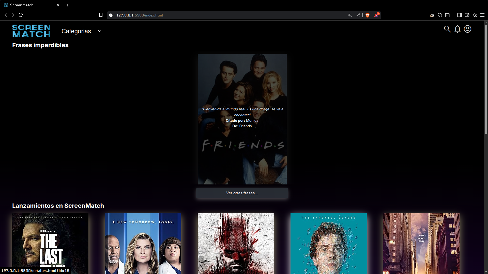
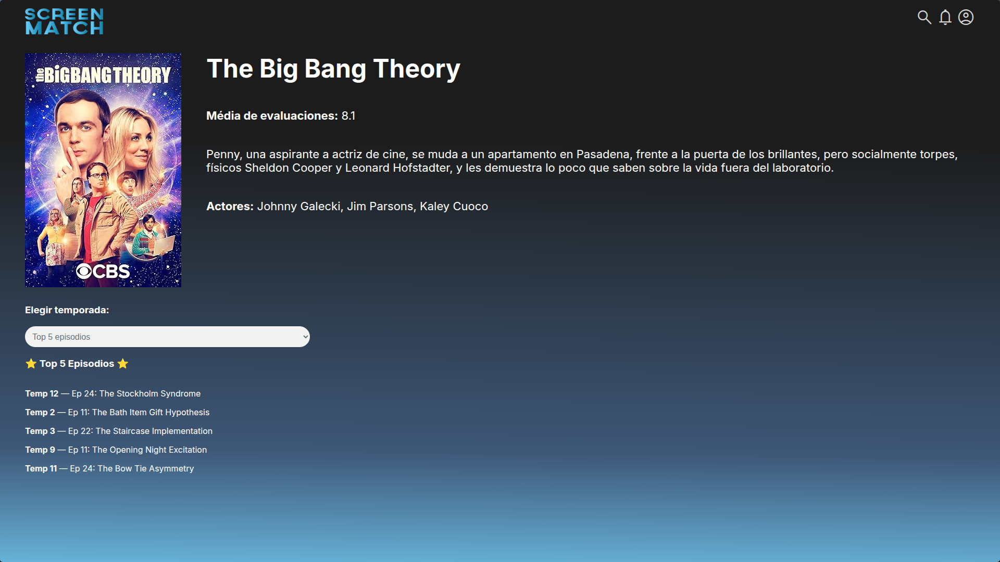

# 📺 ScreenMatch Web: Proyecto Full Stack de Series

¡Bienvenido a **ScreenMatch Web**!  
Este es un proyecto educativo y demostrativo que te enseña cómo crear una aplicación web completa (full stack) para consultar, almacenar y mostrar información de series de TV usando Java (Spring Boot) en el backend y HTML/CSS/JS en el frontend.

---

## 🧩 ¿Qué aprenderás con este proyecto?

- Cómo crear una API REST con Java y Spring Boot.
- Cómo consumir APIs externas (OMDB y Gemini) para obtener y traducir datos.
- Cómo guardar información en una base de datos PostgreSQL.
- Cómo crear una interfaz web moderna con HTML, CSS y JavaScript.
- Cómo conectar el frontend y el backend usando peticiones HTTP.
- Cómo usar Docker para facilitar la configuración de la base de datos.
- Cómo organizar un proyecto real con buenas prácticas.

---

## 📂 Estructura del Proyecto

```sh
screenmatch-web/
│
├── backend/         # Código Java (Spring Boot, API, DB)
│   ├── src/         # Código fuente y recursos
│   ├── docker/      # Archivos para base de datos y pgAdmin (Docker)
│   ├── pom.xml      # Dependencias Maven
│   └── ...          
│
├── frontend/        # Archivos HTML, CSS y JS del sitio web
│   ├── index.html  # Página principal con filtros, top 5, lanzamientos y frases
│   ├── detalles.html  # Página de detalles de una serie
│   ├── scripts/      # Archivos JavaScript
│   ├── css/         # Archivos CSS
│   └── ...
│
├── README.md        # Acerca del proyecto
└── ...
```

---

## 🚦 Requisitos Previos

- **Java 17** o superior ([descargar aquí](https://adoptium.net/))
- **Maven** ([descargar aquí](https://maven.apache.org/download.cgi))  
  (o usa el wrapper incluido: `./mvnw`)
- **Docker** ([descargar aquí](https://www.docker.com/products/docker-desktop/))  
  (opcional, pero recomendado para la base de datos)
- **Visual Studio Code** ([descargar aquí](https://code.visualstudio.com/))  
  (opcional, pero recomendado para editar y probar el frontend)
- **Extensión Live Server** para VS Code (para ver el frontend fácilmente)

---

## ⚙️ Instalación y Configuración Paso a Paso

### 1. Clona el repositorio

```sh
git clone https://github.com/jmikhaelz/screenmatch-web.git
cd screenmatch-web
```

### 2. Configura las variables de entorno y propiedades

#### Backend

- Copia los archivos de ejemplo y edítalos con tus datos:

```sh
cp backend/src/main/resources/application.properties.example backend/src/main/resources/application.properties
cp backend/docker/.env.example backend/docker/.env
```

- **Edita** `backend/src/main/resources/application.properties`  
  Coloca tus claves de OMDB y Gemini, y los datos de conexión a la base de datos.

- **Edita** `backend/docker/.env`  
  Pon los datos de usuario, contraseña y base de datos para PostgreSQL y pgAdmin.

### 3. Levanta la base de datos y pgAdmin con Docker

```sh
cd backend/docker
docker-compose up -d
cd ../../
```

Esto creará dos servicios:
- **db**: PostgreSQL (puerto 5432)
- **pgadmin**: Herramienta web para administrar la base de datos ([http://localhost:8080](http://localhost:8080))

> Puedes detener los servicios con:  
> `docker-compose down`

### 4. Instala las dependencias y ejecuta el backend

Desde la carpeta `backend/`:

```sh
cd backend
./mvnw spring-boot:run
```

Esto compilará y ejecutará la API en [http://localhost:8081](http://localhost:8081).

### 5. Ejecuta el frontend

Desde la carpeta `frontend/`:

- Abre `frontend/index.html` con **Live Server** en VS Code  
  (Haz clic derecho y selecciona "Open with Live Server")
  Debe estar en tu indicardor de navegador en [http://localhost:5500](http://localhost:5500).

¡Listo! Ya puedes navegar por la web y ver las series, detalles, temporadas y frases.

---

## 🛠️ ¿Qué hace cada parte?

### Backend (`backend/`)

- **Spring Boot**: Expone una API REST para consultar series, episodios y frases.
- **OMDB API**: Busca información de series y episodios.
- **Gemini API**: Traduce automáticamente la sinopsis al español.
- **PostgreSQL**: Guarda toda la información para consultas rápidas.
- **pgAdmin**: Herramienta web para ver y administrar la base de datos.

### Frontend (`frontend/`)

- **HTML/CSS/JS**: Interfaz moderna y responsiva.
- **index.html**: Página principal con filtros, top 5, lanzamientos y frases.
- **detalles.html**: Muestra detalles de una serie, temporadas y episodios.
- **scripts/**: Código JavaScript para consumir la API y actualizar la web dinámicamente.

---

## 🧪 Probar la API (Opcional)

Puedes probar los endpoints del backend con herramientas como [Postman](https://www.postman.com/) o tu navegador:

- `GET http://localhost:8081/series`  
  Lista todas las series.
- `GET http://localhost:8081/series/top5`  
  Top 5 series por evaluación.
- `GET http://localhost:8081/series/lanzamientos`  
  Series más recientes.
- `GET http://localhost:8081/series/{id}`  
  Detalles de una serie.
- `GET http://localhost:8081/series/{id}/temporadas/todas`  
  Todos los episodios de una serie.
- `GET http://localhost:8081/series/frases`  
  Frase aleatoria de una serie.

---

## 💡 Consejos para Principiantes

- **Lee los comentarios** en el código, están pensados para ayudarte a entender cada parte.
- Si tienes errores de conexión, revisa que Docker esté corriendo y que los archivos `.env` y `application.properties` tengan los datos correctos.
- Puedes modificar el frontend para practicar y ver los cambios en tiempo real.
- Explora el backend para aprender cómo se conectan los servicios y la base de datos.

---

## 📸 Capturas de Pantalla

### Vista principal



### Detalle de una serie



---

## 👩‍💻 Créditos

- Proyecto original por [Alura Latam](https://www.aluracursos.com/) y [Monica Hillman](https://www.linkedin.com/in/monicamhillman/)
- Modificaciones y personalización por: [jmikhaelz](https://www.linkedin.com/in/jmikhaelz/)

## 📄 Licencia

Este proyecto está bajo la Licencia MIT. Para más detalles, consulta el archivo [LICENSE](LICENSE).