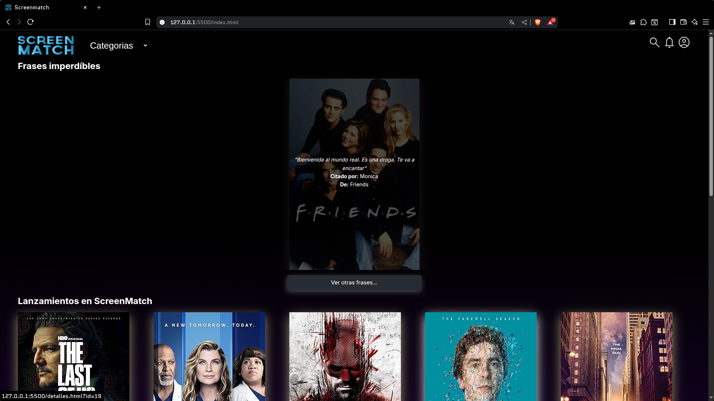
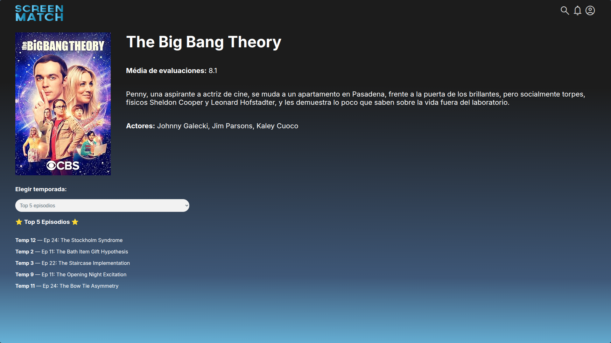

# 🎬 Mi versión personalizada del Front-end ScreenMatch

Este proyecto fue creado a partir del repositorio original [alura-es-cursos/2086-screenmatch-front-end](https://github.com/alura-es-cursos/2086-screenmatch-front-end), desarrollado por [Monica Hillman](https://www.linkedin.com/in/monicamhillman/), como parte de la formación en Java y desarrollo web.

📌 **Este fork/modificación tiene como objetivo adaptar el diseño y la funcionalidad del front-end a mis propias especificaciones**, explorando nuevas ideas tanto visuales como técnicas.

---

## 🚀 ¿Qué incluye esta versión?

- Personalización del diseño y la interfaz de usuario  
- Ajustes en la estructura del código HTML/CSS  
- Cambios en la lógica de integración con una API externa  
- Agregado de nuevas funcionalidades (como filtros, formularios, vistas adicionales, etc.)  
- Mejoras en accesibilidad y experiencia de usuario

> Si quieres ver el proyecto original tal como fue desarrollado en el curso, lo puedes encontrar aquí:  
> 🔗 [https://github.com/alura-es-cursos/2086-screenmatch-front-end](https://github.com/alura-es-cursos/2086-screenmatch-front-end)

---

## 🖼️ Capturas de pantalla

### 🏠 Vista principal de la aplicación

Aquí se muestra la pantalla inicial con el listado de series disponibles:

### 🎞️ Vista de selección de una serie

Una vez seleccionada una serie, se despliega su información detallada, como sinopsis, puntuación y temporadas:

---

## 🛠 Instrucciones para ejecutar

1. Clona el repositorio o descarga el proyecto como `.zip`
2. Abre la carpeta del proyecto en [Visual Studio Code](https://code.visualstudio.com/)
3. Instala la extensión **Live Server**
4. Haz clic derecho en `index.html` y selecciona **"Open with Live Server"**

---

## 💡 Créditos

- Proyecto original por [Alura Latam](https://www.aluracursos.com/) y [Monica Hillman](https://www.linkedin.com/in/monicamhillman/)
- Modificaciones y personalización por: *@jmikhaelz* ✨

---